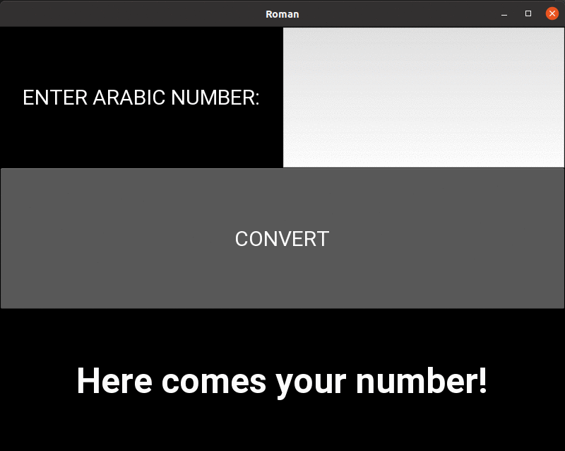

# Arabic to Roman numbers

## The program was created to learn how to use loops and lists, it was my first program with GUI written in `kivy` with "Request and Response" method where backend and frontend are in separate files. Kv file is an introduction to CSS. There are tests in `unittest` and second gui in `tkinter`.

## A program converts Arabic numbers into Roman numerals

